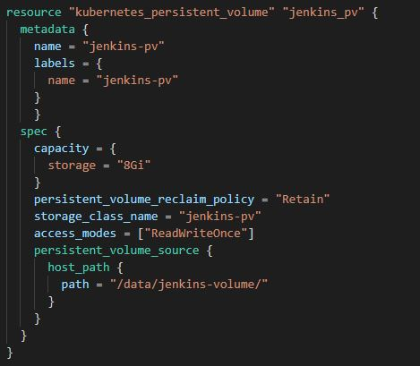
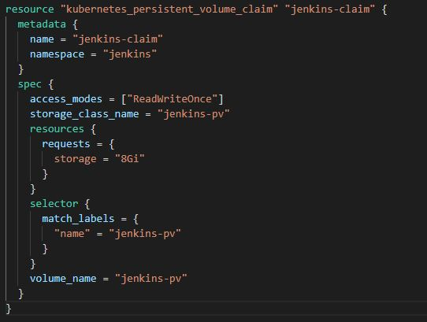
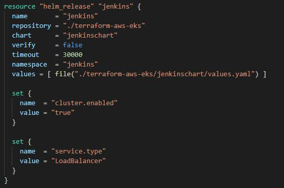
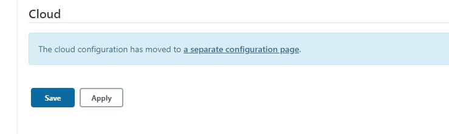
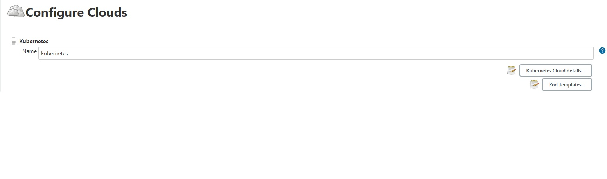
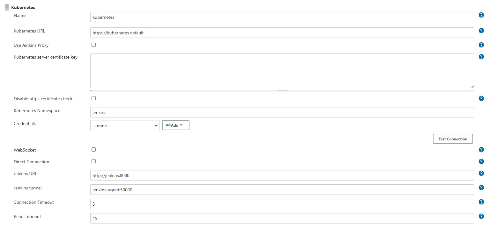
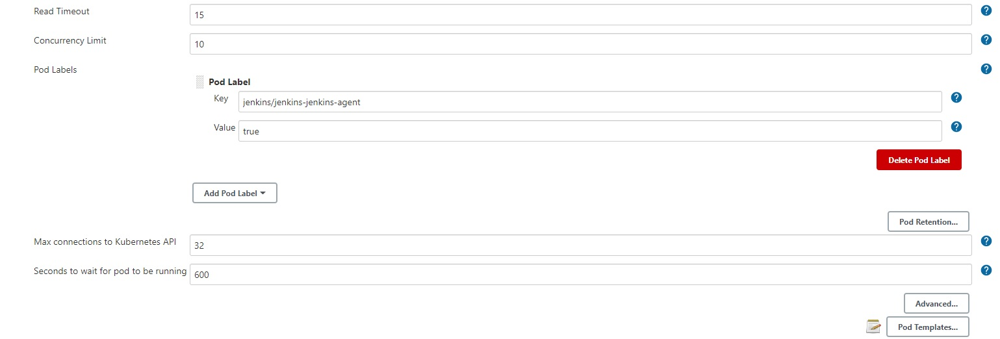
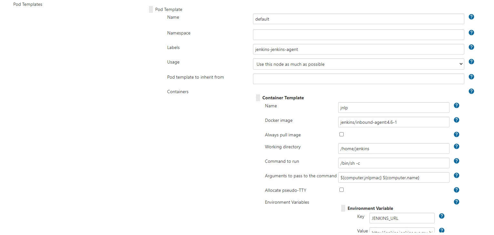
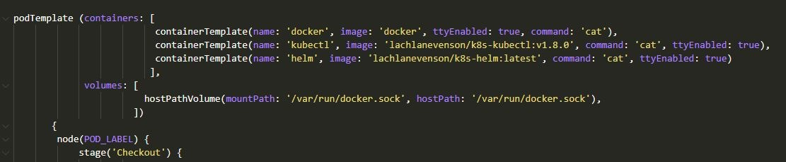

Terraform-AWS-EKS-Helm-Jenkins Pipeline
=========

- Website: https://www.terraform.io


Terraform is a tool for building, changing, and versioning infrastructure safely and efficiently. Terraform can manage existing and popular service providers as well as custom in-house solutions.

If you're new to Terraform and want to get started creating infrastructure, see the [introduction section](http://www.terraform.io/intro) of the Terraform website.

All documentation is available on the [Terraform website](http://www.terraform.io):

  - [Intro](https://www.terraform.io/intro/index.html)
  - [Docs](https://www.terraform.io/docs/index.html)


# About

Implementing a CI/CD pipeline leveraging Kubernetes gives you freedom from hasles of managing runtime environments. At times, teams within an organization used different stack for development which suit them best. And, a runtime agnostic pipeline can make the job easy for everyone. 
This repository contains terraform files to provision an EKS cluster on AWS and facilitate a CI/CD pipeline. It would roll out:
- An EKS Cluster 
- A Worker Node 
- Auto-scaling group for worker node
- A VPC
- Persistent Volume & Volume Claim
- Jenkins


Files: 

1.  [main.tf](./main.tf) provisions a Worker Nodes, Kubernetes & Helm providers using the AWS EKS Module.
2.  [resources.tf](./resources.tf) provisions resources like, namespaces and role bindings.
3.  [variables.tf](./variables.tf) maps role and accounts.
4.  [versions.tf](./versions.tf) contains version details of various providers.
5.  [vpc.tf](./versions.tf) provisions a VPC, subnets and availability zones using the AWS VPC Module.

In addition to this, the repository contains helm charts to enable CI/CD pipeline using Jenkins.

# Getting Started

Following are some prerequisites:

### GIT Clone

Using [Git](https://git-scm.com/), clone this repository into your workspace and navigate to the repostiory folder.

```sh
$ cd terraform-aws-eks
```

### AWS CLI

- You'll need an AWS account with the IAM permissions listed on the [EKS module documentation](https://github.com/terraform-aws-modules/terraform-aws-eks/blob/master/docs/iam-permissions.md)

-  Access your "My Security Credentials" section in your profile. 
    -   Create an access key if you don't have one.

- Configure AWS CLI

    ```sh
    $ aws configure
    AWS Access Key ID [None]: "Your access key id"
    AWS Secret Access Key [None]: "Your secret access key"
    Default region name [None]: "Your preferred region"
    Default output format [None]: json
    ```
### Terraform

-   Download latest version of Terraform from [here](https://www.terraform.io/downloads.html) and after unzipping, configure the system's path. 

### Kubectl

-   Download the latest release of Kubectl from [here](https://kubernetes.io/docs/tasks/tools/install-kubectl/) to run commands against your Kubernetes cluster. Configure the system's path as well.

### Helm

-   Install HELM CLI to work on your application charts from [here](https://helm.sh/docs/intro/install/).

### Open SSL

-   Install Open SSL for certificate generation from [here](https://www.openssl.org/). 

# Usage
Using any preferred CLI, navigate to this repository on your local workspace.

To provision the infrastructure, use the following basic Terraform commands from your preferred CLI in your working directory.

```sh
$ terraform init
 
$ terraform plan
   
$ terraform apply
```

NOTE: Provisioning infrastructure can take some time. It might fail with a connection error. Update your kube-config file with the following command and re-run.

```sh
$ aws eks update-kubeconfig --name <cluster-name> --region <region>
```
Once your infrastrucure is provisioned, you can query various details using kubectl.

# Deploying Jenkins

To deploy Jenkins in you cluster, you can either use helm or terraform resourcing templates. 

***Using Helm***

Start with creating a separate namespace for Jenkins and a service account with appropriate RBAC.

Also, Creating a pesistent volume and binding it with a claim for Jenkins ensures that your data is not lost in case of Jenkins container crash, evict etc.

Navigate to jenkins folder and execute the following commands -

>To create namespace:
  ```sh
  $ kubectl create namespace jenkins
  ```
>To create service account and apply RBAC:
```sh
$ kubectl apply -f jenkins-sa.yaml
```
>To create namespace:
```sh
$ kubectl create namespace jenkins
```
>To create persistent volume:
```sh
$ kubectl apply -f jenkins-volumes.yaml
```
>To create a claim:
```sh
$ kubectl apply -f jenkins-pvc.yaml
```

```sh
$ chart=jenkins/jenkins
$ helm install jenkins -n jenkins -f values.yaml ./helm $chart 
```

***Using Terraform:***

Update your Terraform configuration files to provision:
1.  Resource for creating namespace for Jenkins
2.  Resource for creating a Service Account
3.  Resource for creating a persistent volume
>
4.  Resource to bind the persistent volume with claim for Jenkins namespace.
>
5.  Helm chart resource to provision Jenkins.
>


And execute these again:

```sh
$ terraform init
 
$ terraform plan
   
$ terraform apply
```

> Currently ServiceType has been defined as LoadBalancer (refer Jenkins Helm Chart). This enables a LoadBalancer with a public endpoint. This is not a good practice and your kubernetes services should be exposed only behind an NLB or ALB.

> Jenkins can be installed in your cluster by provisioning a helm resource or by using helm commands. Helm chart for the same are available under helm-jenkins.

# Jenkins Setup

Once the setup is complete:

1. Using kubectl identify the public ip of the service and login. 

2. Login to Jenkins using password configured or use the inital password.
You'll have to do a kubectl exex into the pod to get these details.
    - use kubectl port-forward do connect with the pod.

3. Once logged in, configure the plugins required. 

3. A Kubernetes plugin for Jenkins pipeline has been incorporated in the base image used for this setup.

# Kubernetes Plugin Configuration

- Go to Jenkins Configuration and scroll to the bottom and click on "a separate configuration .page"

> 

- You can see Kubernetes already available as a cloud provider
>

- Click on Kubernetes Cloud Details - 
>

  ***CLick on Test Connection***

- Configure pod details - 
>

>

You have two option after this - 

1. In pod templates, you can specify the type of containers to spin. You can provide the image details and other required parameters accordingly.
2. Specify the containers in your pipeline script.

>

> You can refer [here](https://github.com/jenkinsci/kubernetes-plugin#using-yaml-to-define-pod-templates) for further details.


# Destroy

Use the following command to remove the infrastructure.
```sh
$ terraform destroy
```

# Useful Links

Enable Docker Bridge Network:
-   https://github.com/terraform-aws-modules/terraform-aws-eks/blob/master/docs/enable-docker-bridge-network.md

Docker:
-   https://kubernetes.io/docs/concepts/workloads/pods/init-containers/    
-   [Docker-in-Docker for CI](https://jpetazzo.github.io/2015/09/03/do-not-use-docker-in-docker-for-ci/#:~:text=The%20primary%20purpose%20of%20Docker,into%20your%20Jenkins%20container%20instead.)

Helm Chart Creation:
-   https://opensource.com/article/20/5/helm-charts

Kubectl Cheatsheet:
-   https://kubernetes.io/docs/reference/kubectl/cheatsheet/

Terraform:
-   https://registry.terraform.io/modules/terraform-aws-modules/eks/aws/latest


# Open Items

- Ingress configuration to be incorporated.
- Terraform destroy terminates with unauthorized error.
    ####   Workaround:
    ```
    $ terraform state list

      terraform state rm module.eks.kubernetes_config_map.aws_auth
      terraform state rm kubernetes_persistent_volume.jenkins_pv
      terraform state rm kubernetes_secret.docker_secret
      terraform state rm kubernetes_namespace.jenkins
    ```
    Specify other modules if required.
    Fix yet to be identified.
- Handle image retrieval from private repository in Terraform templates.